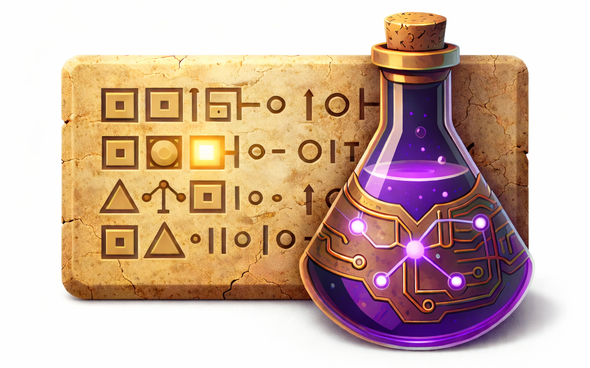

# Relics

A Python ECS (Entity-Component-System) framework with graph database semantics.

*A relic is a snapshot of a world at a particular epoch.*



## Overview

Relics is an engine-agnostic ECS framework that treats relationships as first-class citizens. It provides:

- **Entity-Component-System architecture** for game and simulation development
- **Graph database semantics** with typed relationships between entities
- **Reactive observers** for event-driven responses to data changes
- **Query builder** for efficient entity filtering
- **JSON persistence** with named snapshots (relics)
- **Secondary indexes** for fast entity lookups
- **Optional addons** for spatial indexing, networking, metrics, and more

## Installation

```bash
pip install relics
```

Install with optional addon dependencies:

```bash
# All addons
pip install relics[all]

# Specific addons
pip install relics[prometheus]    # Metrics and monitoring
pip install relics[websocket]     # Real-time multiplayer sync
```

Or install from source:

```bash
git clone https://github.com/ssube/relics.git
cd relics
pip install -e ".[all]"
```

## Quick Start

```python
from pydantic.dataclasses import dataclass
from relics import Component, World

# Define components
@dataclass
class Position(Component):
    x: float
    y: float

@dataclass
class Velocity(Component):
    dx: float
    dy: float

# Create world and register prefabs
world = World()
world.register_prefab(
    "player",
    {Position: Position(x=0, y=0), Velocity: Velocity(dx=0, dy=0)}
)

# Spawn entities
player = world.spawn("player", {Position: Position(x=10, y=20)})

# Query and manipulate
for entity in world.query().with_all([Position, Velocity]).execute_entities():
    pos = entity.get_component(Position)
    vel = entity.get_component(Velocity)
    pos.x += vel.dx
    pos.y += vel.dy

# Advance simulation
world.tick(0.016)  # ~60 FPS
```

## Core Concepts

### Entities

Entities are unique identifiers with no inherent data. They are instantiated from **prefabs** (templates).

```python
# Register a prefab template
world.register_prefab("enemy", {
    Position: Position(x=0, y=0),
    Health: Health(current=100, maximum=100)
})

# Spawn entities from prefab
enemy1 = world.spawn("enemy")
enemy2 = world.spawn("enemy", {Position: Position(x=50, y=50)})  # Override defaults
```

### Components

Components are pure data containers. Define them using Pydantic dataclasses:

```python
from pydantic.dataclasses import dataclass
from relics import Component

@dataclass
class Health(Component):
    current: int
    maximum: int

@dataclass
class Team(Component):
    team_id: str
    name: str

# Component operations
entity.add_component(Health(current=100, maximum=100))
entity.has_component(Health)  # True
health = entity.get_component(Health)
entity.remove_component(Health)
```

### Relationships (Edges)

Relationships are first-class tuples connecting entities:

```python
from relics import Edge, RelationshipValidationError

@dataclass
class AllyTo(Edge):
    trust_level: float = 1.0

    def validate(self, source, target):
        """Optional validation logic."""
        if source.id == target.id:
            raise RelationshipValidationError("Cannot ally with self")
        return True

@dataclass
class ParentOf(Edge):
    pass

# Create relationships
player.add_relationship(AllyTo(trust_level=0.9), ally.id)

# Query relationships
outgoing = player.get_relationships(AllyTo)  # [(edge, target_id), ...]
incoming = ally.get_incoming_relationships(AllyTo)  # [(source_id, edge), ...]

# Check relationships
player.has_relationship(AllyTo, ally.id)  # True
ally.has_incoming_relationship(AllyTo, player.id)  # True

# Remove relationships
player.remove_relationship(AllyTo, ally.id)
```

### Query System

Build queries using the fluent builder pattern:

```python
# Component-based queries
moving_entities = (world.query()
    .with_all([Position, Velocity])
    .with_none([Dead])
    .execute_entities())

# Relationship queries
allies_of_player = (world.query()
    .with_incoming(AllyTo, source=player.id)
    .execute_entities())

entities_with_allies = (world.query()
    .with_relationship(AllyTo)
    .execute_entities())

# Filter predicates
low_health = (world.query()
    .with_all([Health])
    .with_filter(lambda e: e.get_component(Health).current < 20)
    .execute_entities())

# Batch iteration for performance
query = (world.query()
    .with_all([Position, Velocity])
    .iterate([Position, Velocity]))

for entity_id, pos, vel in query.execute_components():
    pos.x += vel.dx * delta
```

### Systems

Systems contain game logic and process entities:

```python
from relics import System, RunOrder, Frequency

class MovementSystem(System):
    def query(self):
        return (self.q
            .with_all([Position, Velocity])
            .with_none([Dead])
            .iterate([Position, Velocity]))

    def deps(self):
        """Declare execution order dependencies."""
        return {
            RunOrder.AFTER: [InputSystem],
            RunOrder.BEFORE: [CollisionSystem],
        }

    def frequency(self):
        """Control execution frequency."""
        return Frequency.EVERY_TICK

    def process(self, entities, components, delta):
        positions, velocities = components
        for i, entity in enumerate(entities):
            positions[i].x += velocities[i].dx * delta
            positions[i].y += velocities[i].dy * delta

# Register systems
world.register_system(MovementSystem())
```

### Observers

Observers react to events in the world:

```python
from relics import (
    OnEntityCreated,
    OnEntityDestroyed,
    OnComponentAdded,
    OnComponentRemoved,
    OnRelationshipAdded,
    OnRelationshipRemoved,
    OnCustomEvent,
    EntityObserver,
    ComponentObserver,
    RelationshipObserver,
)

# Single-event observers
class DeathObserver(OnComponentAdded):
    component_type = Dead

    def on_component_added(self, entity, component):
        print(f"Entity {entity.id} died!")
        self.world.emit(EntityDied(entity.id))

# Multi-event observers for lifecycle tracking
class HealthTracker(ComponentObserver):
    component_type = Health

    def on_component_added(self, entity, component):
        print(f"Health added to {entity.id}")

    def on_component_changed(self, entity, component, field_name, old_value, new_value):
        print(f"Health {field_name} changed: {old_value} -> {new_value}")

    def on_component_removed(self, entity, component):
        print(f"Health removed from {entity.id}")

class PlayerLifecycle(EntityObserver):
    prefab = "player"  # Filter to specific prefab, or None for all

    def on_entity_created(self, entity):
        print(f"Player spawned: {entity.id}")

    def on_entity_destroyed(self, entity):
        print(f"Player removed: {entity.id}")

class AllianceTracker(RelationshipObserver):
    edge_type = AllyTo

    def on_relationship_added(self, source, edge, target):
        print(f"{source.id} allied with {target.id}")

    def on_relationship_removed(self, source, edge, target):
        print(f"{source.id} broke alliance with {target.id}")

# Register observers
world.observe(DeathObserver())
world.observe(HealthTracker())
world.observe(PlayerLifecycle())
```

### Custom Events

Define and emit custom events:

```python
from relics import CustomEvent

@dataclass
class EntityDied(CustomEvent):
    entity_id: EntityId
    killer_id: Optional[EntityId] = None

@dataclass
class LevelCompleted(CustomEvent):
    level_id: str
    score: int

# Emit events
world.emit(EntityDied(entity.id, killer_id=attacker.id))

# Observe custom events
class ScoreObserver(OnCustomEvent):
    event_type = EntityDied

    def on_event(self, event):
        if event.killer_id:
            killer = self.world.get_entity(event.killer_id)
            # Award points...
```

### Change Tracking

Use `@monitored_component` to track component changes:

```python
from relics import monitored_component, OnComponentChanged

@monitored_component
class TrackedHealth(Component):
    current: int
    maximum: int

class HealthChangeObserver(OnComponentChanged):
    component_type = TrackedHealth

    def on_component_changed(self, entity, component, field_name, old_value, new_value):
        if field_name == "current":
            damage = old_value - new_value
            if damage > 0:
                print(f"Entity took {damage} damage!")
```

### Shared Components

By default, all prefab components are deep copied when spawning entities, ensuring each entity has independent data. Use `@shared_component` to opt out of copying for components that should share the same instance (useful for large immutable data like mesh references):

```python
from relics import shared_component

@shared_component
@dataclass
class SharedMeshData(Component):
    vertices: List[float]  # Large immutable data
    indices: List[int]

# Register prefab with shared component
world.register_prefab("model", {SharedMeshData: SharedMeshData(vertices=[...], indices=[...])})

# All spawned entities share the same SharedMeshData instance
entity1 = world.spawn("model")
entity2 = world.spawn("model")
assert entity1.get_component(SharedMeshData) is entity2.get_component(SharedMeshData)  # True
```

**Note:** `@shared_component` and `@monitored` are mutually exclusive. A component cannot be both shared and monitored because monitored components need unique instances for change tracking.

### Temporary Components

Use `@temporary_component` to mark components that should not be persisted (saved/loaded). This is useful for runtime state that doesn't need to survive a save/load cycle:

```python
from relics import temporary_component

@temporary_component
@dataclass
class InputState(Component):
    keys_pressed: List[str]  # Runtime state, not saved

@temporary_component
@shared_component
@dataclass
class CachedRenderData(Component):
    texture_id: int  # Shared runtime cache, not saved
```

Temporary components:
- Are skipped during `save()` operations
- Will not be present after `load()`
- Can be combined with `@shared_component` or `@monitored`

### Secondary Indexes

Create indexes for efficient entity lookups:

```python
# Lazy index (recomputes on each access)
world.create_index(
    name="alive_players",
    query=world.query().with_all([Health]).with_none([Dead]),
    materialized=False
)

# Materialized index (cached, updates when watched components change)
world.create_index(
    name="low_health",
    query=world.query()
        .with_all([Health])
        .with_filter(lambda e: e.get_component(Health).current < 20),
    watches=[Health],
    materialized=True
)

# Use indexes
for entity in world.index("alive_players"):
    print(entity.id)

count = world.index("low_health").count()
```

### Persistence

Save and load world state:

```python
from relics import save, load, save_relic, load_relic, list_relics

# Save world to JSON
save(world, "game_state.json")

# Load world from JSON
world2 = World()
load(world2, "game_state.json", component_registry={
    "Position": Position,
    "Health": Health,
}, edge_registry={
    "AllyTo": AllyTo,
})

# Named snapshots (relics)
save_relic(world, "before_boss", "saves/")
save_relic(world, "autosave", "saves/", overwrite=True)

# List available relics
relics = list_relics("saves/")
for info in relics:
    print(f"{info.name} - epoch {info.epoch} - {info.created_at}")

# Load a relic
load_relic(world, "before_boss", "saves/", component_registry={"Position": Position})

# Export entity for debugging/tooling
data = world.export_entity(entity.id)
print(data)  # {"id": "player_123", "prefab": "player", "components": {...}, ...}
```

### Prefab Management

```python
from relics import load_prefabs_from_json, save_prefabs_to_json, get_prefab, list_prefabs

# Load prefabs from JSON file
load_prefabs_from_json(world, "prefabs.json", component_registry={
    "Position": Position,
    "Health": Health,
})

# Save prefabs to JSON
save_prefabs_to_json(world, "prefabs_backup.json")

# Get prefab definition
prefab = get_prefab(world, "player")
print(prefab)  # {Position: Position(...), Health: Health(...)}

# List all prefabs
names = list_prefabs(world)
```

## Complete Example

```python
from pydantic.dataclasses import dataclass
from relics import (
    Component, Edge, World, System, RunOrder,
    OnComponentAdded, CustomEvent, monitored_component
)

# Components
@dataclass
class Position(Component):
    x: float
    y: float

@dataclass
class Velocity(Component):
    dx: float
    dy: float

@monitored_component
class Health(Component):
    current: int
    maximum: int

@dataclass
class Dead(Component):
    pass

@dataclass
class Team(Component):
    team_id: str

# Edges
@dataclass
class AllyTo(Edge):
    trust_level: float = 1.0

# Custom Events
@dataclass
class EntityDied(CustomEvent):
    entity_id: "EntityId"

# Systems
class MovementSystem(System):
    def query(self):
        return (self.q
            .with_all([Position, Velocity])
            .with_none([Dead])
            .iterate([Position, Velocity]))

    def process(self, entities, components, delta):
        positions, velocities = components
        for i in range(len(entities)):
            positions[i].x += velocities[i].dx * delta
            positions[i].y += velocities[i].dy * delta

# Observers
class DeathObserver(OnComponentAdded):
    component_type = Dead

    def on_component_added(self, entity, component):
        self.world.emit(EntityDied(entity.id))
        print(f"Entity {entity.id} has died!")

# Main
def main():
    world = World()

    # Register prefabs
    world.register_prefab("player", {
        Position: Position(x=0, y=0),
        Velocity: Velocity(dx=0, dy=0),
        Health: Health(current=100, maximum=100),
        Team: Team(team_id="heroes"),
    })

    # Register systems and observers
    world.register_system(MovementSystem())
    world.observe(DeathObserver())

    # Spawn entities
    player = world.spawn("player")
    ally = world.spawn("player", {Position: Position(x=10, y=0)})

    # Create alliance
    player.add_relationship(AllyTo(trust_level=1.0), ally.id)

    # Game loop
    for _ in range(100):
        # Move player
        vel = player.get_component(Velocity)
        vel.dx = 1.0
        vel.dy = 0.5

        # Advance simulation
        world.tick(0.016)

    # Query allies
    allies_query = world.query().with_incoming(AllyTo, source=player.id)
    print(f"Player has {sum(1 for _ in allies_query.execute_entities())} allies")

    # Get final position
    pos = player.get_component(Position)
    print(f"Player position: ({pos.x}, {pos.y})")

if __name__ == "__main__":
    main()
```

## Addons

Relics includes optional addons for extended functionality:

### Spatial Indexing

Efficient 2D/3D spatial queries using QuadTree and Octree data structures.

```python
from relics.addons.spatial import Position2D, create_spatial_index_2d, QuadTreeBounds

# Create spatial index
index = create_spatial_index_2d(
    world,
    bounds=QuadTreeBounds(center_x=500, center_y=500, half_width=500, half_height=500),
)

# Query nearby entities
for entity in index.query_circle(center_x=250, center_y=250, radius=100):
    print(f"Nearby: {entity.id}")

# Find k-nearest neighbors
nearest = index.query_nearest(x=500, y=500, count=5)
```

**Features:**
- 2D (QuadTree) and 3D (Octree) indexing
- Circle, rectangle, sphere, and box queries
- K-nearest neighbor search
- Automatic updates via observers
- QueryBuilder integration with `with_index()`

[Full documentation →](src/relics/addons/spatial/README.md)

### Tile Grid

Chunked tile system for 2D and layered 3D worlds.

```python
from relics.addons.tilegrid import (
    ChunkMetadata, TileVisualLayer,
    create_chunk_index, get_tile_at,
)

# Create chunk index and spawn chunks
index = create_chunk_index(world, chunk_size=32)
world.spawn("grass_chunk")

# Query tiles by world position
tile = get_tile_at(world, 5.0, 5.0, "ground", index)
```

**Features:**
- Chunked tile maps with configurable sizes (16, 32, 64, 128)
- Multiple visual layers with z-ordering
- Per-tile elevation and collision data
- Observer-driven dirty tracking
- O(1) chunk lookup

[Full documentation →](src/relics/addons/tilegrid/README.md)

### Prometheus Metrics

Production monitoring with Prometheus-compatible metrics.

```python
from relics.addons.prometheus import WorldMetricsCollector, MetricsServer

# Create collector and server
collector = WorldMetricsCollector(world, world_id="game_server")
server = MetricsServer(port=8000)
server.start()

# Metrics are collected automatically or manually
while running:
    world.tick(0.016)
    collector.collect()
```

**Metrics exposed:**
- Entity counts (total, by prefab, by component)
- System execution times (histogram)
- Observer queue length and events processed
- Index entity counts
- Relationship counts by type
- Tick duration and world epoch

[Full documentation →](src/relics/addons/prometheus/README.md)

### WebSocket Sync

Real-time multiplayer synchronization over WebSocket.

```python
# Server
from relics.addons.websocket import WebSocketServerDriver

server = WebSocketServerDriver(host="localhost", port=8765)
server.attach(world)
await server.start()

# Client
from relics.addons.websocket import WebSocketClientDriver

client = WebSocketClientDriver(uri="ws://localhost:8765", client_id="player_1")
client.attach(world)
await client.connect()
await client.sync()
```

**Features:**
- Full world state synchronization
- Incremental component change propagation
- Entity lifecycle events (create/destroy)
- Component whitelist for security
- Heartbeat and reconnection handling

[Full documentation →](src/relics/addons/websocket/README.md)

### Procedural Prefabs

Graph-based entity generation with conditional components and parameter inheritance.

```python
from relics.addons.procedural_prefabs import (
    ProceduralPrefabRegistry, get_children, HasEquipped,
)

# Create registry and load definitions
registry = ProceduralPrefabRegistry(world, rng_seed=42)
registry.load_directory("prefabs/procedural/")

# Spawn procedural entity with parameters
character = registry.spawn("character", {
    "race": "dwarf",
    "class": "warrior",
})

# Query generated attachments
for equipped in get_children(character, HasEquipped):
    print(f"Equipped: {equipped.id}")
```

**Features:**
- JSON/YAML-based prefab definitions
- Conditional component selection (`when` clauses)
- Parameter inheritance and derivation
- Automatic child entity spawning
- Cascade deletion support

[Full documentation →](src/relics/addons/procedural_prefabs/README.md)

## API Reference

### Core Types

| Type | Description |
|------|-------------|
| `Component` | Base class for all components |
| `Edge` | Base class for relationship edges |
| `CustomEvent` | Base class for custom events |
| `EntityId` | Structured entity identifier (prefab + sequence) |
| `Entity` | Live handle to an entity |
| `World` | Central manager for entities, systems, and observers |

### Query Builder

| Method | Description |
|--------|-------------|
| `with_all(types)` | Entities must have ALL components |
| `with_any(types)` | Entities must have AT LEAST ONE component |
| `with_none(types)` | Entities must have NONE of these components |
| `with_relationship(edge_type, target=None)` | Entities with outgoing relationship |
| `with_incoming(edge_type, source=None)` | Entities with incoming relationship |
| `with_filter(predicate)` | Filter by predicate function |
| `iterate(types)` | Prepare component arrays for batch processing |
| `execute_ids()` | Return matching entity IDs |
| `execute_entities()` | Return Entity handles |
| `execute_components()` | Return entity ID with requested components |

### Observers

| Class | Trigger |
|-------|---------|
| `OnEntityCreated` | Entity spawned |
| `OnEntityDestroyed` | Entity removed |
| `OnComponentAdded` | Component added to entity |
| `OnComponentRemoved` | Component removed from entity |
| `OnComponentChanged` | `@monitored` component value changed |
| `OnRelationshipAdded` | Relationship created |
| `OnRelationshipRemoved` | Relationship removed |
| `OnCustomEvent` | Custom event emitted |
| `EntityObserver` | Multi-event: created + destroyed |
| `ComponentObserver` | Multi-event: added + changed + removed |
| `RelationshipObserver` | Multi-event: added + removed |

### Errors

| Error | Description |
|-------|-------------|
| `RelicError` | Base exception |
| `EntityNotFoundError` | Entity does not exist |
| `ComponentNotFoundError` | Entity lacks requested component |
| `DuplicateComponentError` | Entity already has component type |
| `PrefabNotFoundError` | Prefab does not exist |
| `IndexNotFoundError` | Index does not exist |
| `RelationshipValidationError` | Edge validation failed |
| `SystemDependencyCycleError` | System dependencies form a cycle |

## Contributing

1. Fork the repository
2. Create a feature branch
3. Write tests (maintain 98%+ coverage)
4. Run `pytest tests/ --cov=src/relics`
5. Run `flake8 src/ tests/` and `mypy src/`
6. Submit a pull request

## License

MIT License - see LICENSE file for details.
